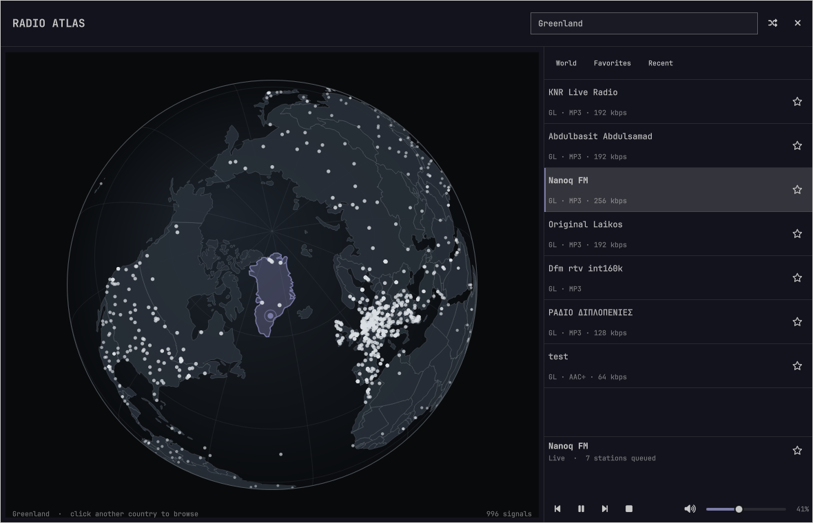

# Radio Atlas

Explore live radio on a rotatable globe from the Omarchy bar. Click a station
signal to play it, or click a country to browse its stations. Playback runs in
Omarchy's existing `mpv` and `mpv-mpris` setup, so `omarchy.media` provides the
usual play, pause, previous, and next controls.

[View Radio Atlas on the Omarchy Plugin Marketplace](https://omarchyplugins.com/plugin.html?id=akshar.radio-atlas)



## Features

- Precise drag rotation and deep wheel zoom on a theme-aware globe
- A fast cached world view that progressively adds thousands of stations and keeps the session catalog when closed
- Country stations stay on the session globe and take priority over background signals
- Country-level map estimates when a station has no published coordinates
- Automatic country focus for the station that is actually playing
- Current station identity, track metadata, and one-click favoriting in the player
- Instant cached results while full-directory search and country browsing refresh from Radio Browser
- Random tuning that avoids recent stations, plus favorites and listening history
- Independent volume slider, mute, and bar-wheel volume control
- Click-through desktop focus outside the atlas panel
- Automatic dismissal when Omarchy starts its screensaver
- Keyboard navigation
- Persistent world and country caches with background refresh and transient retries
- Automatic skip to the next playlist entry when a stream fails

## Install

```bash
omarchy plugin add https://github.com/AksharP5/omarchy-radio-atlas.git --enable
```

Radio Atlas uses `bubblewrap`, `curl`, `iproute2`, `jq`, `mpv`, `python`,
`socat`, `coreutils`, and `util-linux`. These packages ship with Omarchy.
`mpv-mpris` connects playback to `omarchy.media` and is also part of the
standard Omarchy installation.

## Remove

Stop the independent radio player before removing the plugin:

```bash
~/.config/omarchy/plugins/akshar.radio-atlas/radio-player stop
omarchy plugin remove akshar.radio-atlas
```

Favorites, listening history, and the saved volume remain in
`~/.local/share/radio-atlas/state.json` so reinstalling restores them. Remove
`~/.local/share/radio-atlas/` manually if you also want to delete that data.

## Controls

| Input | Action |
| --- | --- |
| Drag globe | Rotate |
| Wheel over globe | Zoom |
| Click signal | Play station |
| Click country | Browse country |
| `/` | Focus search |
| Up / Down | Move through stations |
| Enter | Play selected station |
| Space | Play or pause |
| `R` | Tune a random station |
| `F` | Favorite selected station |
| `+` / `-` | Raise or lower radio volume |
| `M` | Mute or unmute |
| Escape | Clear search or close |

On the bar, left click opens Radio Atlas, middle click tunes randomly, right
click stops its player, and the mouse wheel adjusts radio volume.

## Data and privacy

Station data comes from the community-run
[Radio Browser](https://www.radio-browser.info/). Radio Atlas sends its name
and version as the HTTP user agent. Starting a station calls Radio Browser's
click-count endpoint. Favorites and history stay in
`~/.local/share/radio-atlas/state.json`.

Station metadata and stream URLs are community supplied. Labels are rendered
as plain text. Playback runs in an isolated network namespace and reaches
stations through a bounded proxy that rejects private and effectively local
destinations, including after redirects. Remote metadata and local JSON are
size- and record-limited before they reach the shell. Radio Atlas still connects
directly to third-party stations; HTTP streams are unencrypted. Only play
stations you trust.

Map geometry comes from public-domain Natural Earth data.

## Troubleshooting

Player and proxy diagnostics are written to
`$XDG_RUNTIME_DIR/omarchy-radio-atlas/mpv.log` and `proxy.log`. If saved state
is malformed, oversized, or contains too many entries, Radio Atlas refuses to
overwrite it and reports
`~/.local/share/radio-atlas/state.json`; back up that file before repairing or
removing it.

## Development

```bash
./tests/run
qmllint -I /usr/share/omarchy/shell BarWidget.qml Globe.qml RadioAtlas.qml
```
