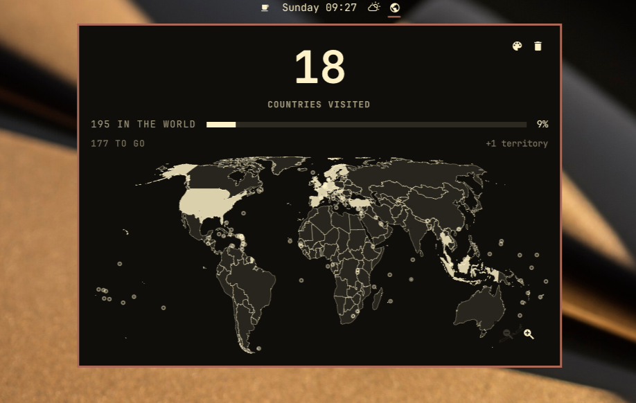

# Omamap

A world map that lives in your Omarchy bar. Click a country you have been to and
it fills in; the number above the map goes up. Click it again and it does not.



## Install

```sh
omarchy plugin add https://github.com/ejuro/omamap.git --enable
```

## Use

- Left-click the globe in the bar for the map.
- Left-click a country to mark it visited, left-click again to clear it.
- Scroll to zoom — the map zooms about the pointer, so the place you are looking
  at stays under the cursor. Drag to pan.
- Or the controls in the bottom-right of the map: 󰍊 out, 󰍋 in, 󰇧 back to the
  whole world. Or the keyboard: `+` `-` `0`, arrows pan, `Esc` closes.
- Hovering a country names it. Territories name who administers them, so
  Greenland reads *Greenland · Denmark*.
- 󰏘 in the top-right picks the colour the map is filled in, from your theme's own
  palette, minus anything that would vanish against the panel. Changing themes
  puts it back to matching the new one. `c` opens it.
- 󰆴 beside it clears the map, after asking. `x` does the same.
- The widget's *Bar label* setting puts the count or the percentage next to the
  globe in the bar.

## The count

195 is the 193 UN member states plus the two permanent observers, the Holy See
and Palestine.

Territories and dependencies — Greenland, Puerto Rico, Hong Kong, Taiwan — are on
the map and can be filled in, because they are real places you can have been to.
They are counted on their own line, so the big number keeps meaning what it says.

## State

```
${XDG_STATE_HOME:-~/.local/state}/omamap/state.json
```

A sorted list of ISO 3166-1 alpha-3 codes, and the map colour if you picked one.
Readable, diffable, and yours to back up:

```json
{
  "version": 1,
  "visited": ["DNK", "ISL", "NOR", "SWE"]
}
```

## How the map was made

The projection is Equal Earth, which is equal-area: a country's size on screen is
proportional to its size on Earth. On a Mercator map Greenland looks bigger than
Africa, which is a strange thing to stare at while counting how much of the world
you have seen.

The borders are Natural Earth's 1:50m country polygons, public domain, taken from
[nvkelso/natural-earth-vector](https://github.com/nvkelso/natural-earth-vector) at
tag `v5.1.2` — upstream itself, not a repackaging. That GeoJSON is committed to
this repository, with its SHA-256, under `tools/source/`.

`tools/build-data.mjs` verifies the checksum, projects the coordinates, simplifies
them to the precision the deepest zoom can actually show, and writes
`WorldData.js`. It then refuses to write unless the result still holds up: all 195
countries present, total land area within 2% of 134 million km², the nine largest
countries coming out as the nine largest countries, and a handful of countries
spanning four orders of magnitude landing within 12% of their published areas.

Some thirty countries come out too small to click at world zoom, and three —
Vatican City, Monaco and Tuvalu — are smaller than a single pixel at any zoom the
map goes to. Those draw as dots, which turn back into real outlines as you zoom
past them, so every one of the 195 is clickable without zooming at all.

## Dependencies

**None.** No `package.json`, no `npm install`, no libraries. The GeoJSON walk, the
Equal Earth projection, the Visvalingam simplifier, the point-in-polygon hit
testing, the contrast filter behind the colour picker and the tests are all code
in this repository. The one file that came from anywhere else is that Natural
Earth GeoJSON, which is committed, checksummed, and only ever handed to
`JSON.parse`.

At runtime it needs Omarchy and nothing else. **No network access and no
privileged commands** — the borders ship inside the plugin, so it never opens a
socket. It writes one file, its own `state.json`, and reads two: your theme's
`colors.toml` and `theme.name`, so the map can match the theme and follow it when
you switch.

## Remove

```sh
omarchy plugin remove io.github.ejuro.omamap
rm -rf ${XDG_STATE_HOME:-~/.local/state}/omamap
```

## License

MIT. Map data is public domain, per Natural Earth's terms of use.
