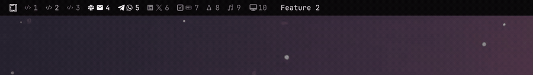

# Workspace name

An [Omarchy](https://omarchy.org) bar widget that gives the current workspace a
name and an icon, and lets you set both.



Hyprland workspaces are numbered, and a number tells you where you are but not
what you were doing there. This widget shows a row of workspace buttons with
the current workspace's name or icon beside them: `invoicing`, `bug #4412`,
`reading`. Switch workspaces and the label follows.

A workspace can also carry an icon, on its own or in front of the name. An icon
alone is often enough — a workspace can be the one with the terminals without
also being called "terminals" — and it reads faster in the corner of your eye
than a word does.

The widget draws a row of workspace number buttons by default, with the current
workspace's name or icon beside them. Click the workspace you are already on to
open the naming panel.

## Install

```bash
omarchy plugin add https://github.com/jankeesvw/omarchy-workspace-name.git --enable
```

The widget lands in the left section of the bar by default. Move it with
`omarchy bar move`, or from the bar's own settings panel.

## Remove

```bash
omarchy plugin remove jankeesvw.workspace-name
```

That takes the widget out of the bar and deletes the plugin. The names and
icons you gave your workspaces are yours, not the plugin's, so they stay in
`$XDG_STATE_HOME/workspace-hud/`. Delete that directory if you want them gone
too.

## Use

Workspace numbers appear on the bar by default. Clicking one takes you to that
workspace, and clicking the one you are already on opens the naming panel,
since there is nothing left to switch to. It holds a name field and, under it,
a grid of icons. Fill in either, both, or neither,
then press Enter to save. An empty name clears the name, the first cell of the
grid (`×`) clears the icon, and clearing both hides the label. Escape closes
without saving.

The panel opens on the name, because renaming is what you came for on most
days. Press Down to step into the grid and walk it with the arrow keys. Every
move takes the icon under the cursor, so what you are pointing at is always
what Enter will save. The icon the workspace already has is where the cursor
starts and stays highlighted, Up off the top row hands focus back to the name,
and clicking a cell does the same as walking onto it.

The grid holds what a workspace is usually for: shells and editors, mail and
chat, media, infrastructure. Brand marks are mostly left out, since a
workspace is a kind of work rather than a logo. For anything the grid does not
have, write the file directly. That takes a codepoint as readily as the glyph,
which is covered below.

You can also bind a key to open the panel directly:

```lua
-- ~/.config/hypr/bindings.lua
o.bind(hyper .. "R", "Workspace name", "omarchy-shell shell toggle jankeesvw.workspace-name")
```

## Workspace indicators

Each button carries the workspace's icon where one is set and its number where
none is. Clicking one focuses that workspace, and clicking the focused one
opens the panel to name it. It stands in for the
`omarchy.workspaces` widget rather than sitting beside it, so take that one out
of the bar first.

An icon standing in for the number keeps a button one character wide, which is
the width the stock indicators are built at, so nothing about the shape of the
bar changes. Set `"numbers": true` to show both instead. That reads as `icon 4`
and grows every button to fit.

The reason to want this: an icon on the workspace you are already standing on
is only half useful, since the row of numbers is where you look to find the one
you want. Feeding the row and the label from the same file is what keeps them
from ever disagreeing.

The indicators are on by default. To hide them, set `"indicators": false` in
the widget's entry in `~/.config/omarchy/shell.json`:

```json
{ "id": "jankeesvw.workspace-name", "indicators": false }
```

## Where names and icons are stored

One plain-text file per workspace, in `$XDG_STATE_HOME/workspace-hud/<id>`,
and the icon beside it in `<id>.icon` (usually `~/.local/state/workspace-hud/1`
and `1.icon`, and so on). No daemon, no database.

That means other tooling can join in. Reading the name of workspace 3 is a
`cat`:

```bash
cat ~/.local/state/workspace-hud/3
```

And setting one is a redirect. The file is watched, so the bar picks up the
change without being told:

```bash
echo "deploying" > ~/.local/state/workspace-hud/3
```

Icons work the same way, and the file accepts a codepoint as readily as the
glyph itself — which is what makes them scriptable at all, since a Private Use
Area character is awkward to get into a shell command and impossible to read
back in a diff:

```bash
echo f120 > ~/.local/state/workspace-hud/3.icon
```

Which is handy for scripts: a build wrapper can label the workspace it is
running in, and clear the label when it finishes.

The directory is kept private to your account — mode 700, with 600 files —
because what you call your workspaces says what you are working on. Your own
scripts read and write it as freely as ever; other accounts on the machine do
not. A directory you deliberately made a symlink is left as you set it up.

A name is shown as one line of plain text, with angle brackets removed and at
most 64 characters, since the file is whatever was echoed into it rather than
something this widget wrote.

Names are not remembered across reboots any longer than the state directory
is; nothing prunes them, so a name stays on a workspace until you clear it.

## Where the icons come from

The font. There is nothing icon-specific in the widget: it draws a character,
and if the bar's font has that character you get a picture instead of a box.

That works because Omarchy's bar uses a **Nerd Font** — an ordinary monospace
face patched to carry whole icon sets (Font Awesome, Material Design,
Devicons, Octicons, Seti-UI) in Unicode's Private Use Area. An icon is
literally a character, which is why `echo f120 > 3.icon` is enough to set one.

**Recommended: whatever Nerd Font your bar already uses.** Omarchy ships
[JetBrainsMono Nerd Font](https://www.nerdfonts.com/font-downloads) and the
grid above was checked glyph by glyph against it, so the presets are safe out
of the box. Any other Nerd Font works too; only the coverage changes.

To go beyond the grid, search [the Nerd Fonts cheat
sheet](https://www.nerdfonts.com/cheat-sheet) by name and take the codepoint.
Check it before you rely on it, because the cheat sheet describes the whole
Nerd Fonts collection and your build may be a subset:

```bash
fc-list ":charset=f121" family    # empty means your font does not have it
```

If it comes back empty, you are not stuck: the toolkit falls back to any other
installed font that does have the codepoint. Installing a font that carries the
icon is enough — nothing has to be configured. The one case fallback cannot fix
is a codepoint your main font already uses for something else, since the main
font wins; there you would have to change the bar's font rather than add one.

## Requirements

Omarchy with `omarchy-shell` (the Quickshell-based bar) and Hyprland. Nothing
else: no extra packages, no helper scripts.

## License

MIT
