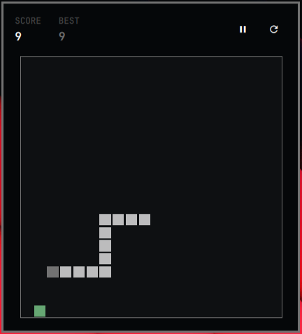

# Omarchy Snake

A compact, theme-aware Snake game that lives in the Omarchy 4 bar. It uses the
native Quickshell plugin APIs, follows the active Omarchy palette and requires
no external runtime dependencies.



## Install

```bash
omarchy plugin add https://github.com/sebasgl23/omarchy-snake.git --enable
```

The widget defaults to the right section of the bar. You can move it with the
standard Omarchy bar commands.

## Update

```bash
omarchy plugin update sebasgl23.snake
```

## Uninstall

```bash
omarchy plugin remove sebasgl23.snake
```

## Controls

- Arrow keys, WASD or HJKL: move
- Space, Enter or P: play and pause
- R: restart
- Escape: close the panel

Closing the panel pauses the current game. The best score is stored in the
widget entry in `~/.config/omarchy/shell.json`.

## Development

```bash
omarchy plugin validate .
qmllint -I /usr/share/omarchy/shell BarWidget.qml Panel.qml
node tests/run-model-tests.js
qmltestrunner -input tests
```

For local development, copy the repository into
`~/.config/omarchy/plugins/sebasgl23.snake` and enable it with:

```bash
omarchy plugin enable sebasgl23.snake --section right
```

## License

MIT
