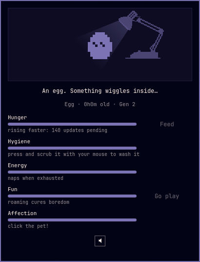
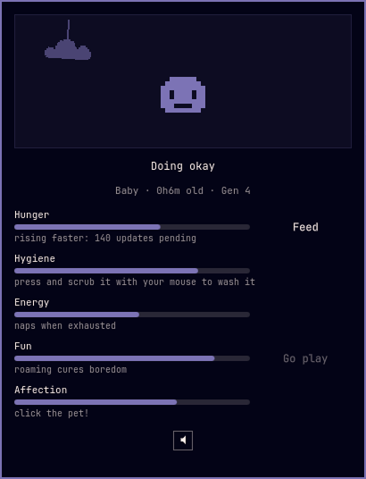
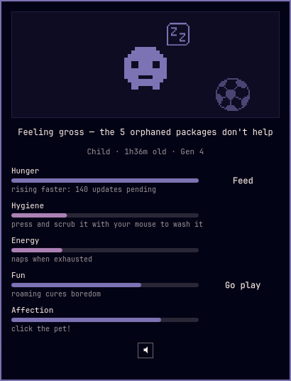
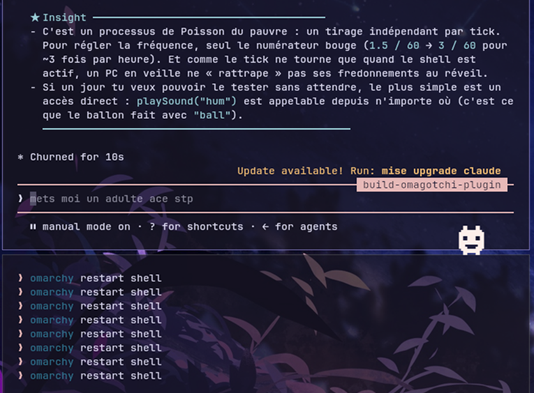

# Omagotchi

A 1-bit desktop pet for [Omarchy](https://omarchy.org), in the spirit of the
1997 originals. It hatches in your bar, grows up in a little room, and once it
is old enough it goes out to roam your screen and climb your windows. Feed it,
scrub it, cuddle it, let it play — and one day, let it go.

<p align="center">
  
</p>

## Needs

| Need | Emote | Rises | You fix it by |
| --- | :-: | --- | --- |
| Hunger | <picture><source media="(prefers-color-scheme: dark)" srcset="docs/emotes/hungry-dark.png"></picture> | over time — faster while updates are pending | the Feed button|
| Hygiene | <picture><source media="(prefers-color-scheme: dark)" srcset="docs/emotes/dirty-dark.png"></picture> | over time — faster while orphaned packages linger | pressing and **scrubbing it with your mouse** in its room  |
| Energy | <picture><source media="(prefers-color-scheme: dark)" srcset="docs/emotes/sleepy-dark.png"></picture> | over time — faster while roaming | letting it nap: it dozes off on its own when exhausted, wherever it is, and a sleepy pet brought home goes straight to bed |
| Fun | <picture><source media="(prefers-color-scheme: dark)" srcset="docs/emotes/bored-dark.png"></picture> | over time | letting it out to roam |
| Affection | <picture><source media="(prefers-color-scheme: dark)" srcset="docs/emotes/sad-dark.png"></picture> | over time — and a big fall makes it sad | petting it |

When several needs complain at once, the emote bubble above its head cycles
through them. Care happens at home: while it's out roaming, the panel shows
an empty room and feeding/washing wait until you call it back. Feeding or
washing a sleeping pet wakes it first; if it is still tired afterwards it
goes back to sleep on its own.

Needs rise with active shell time. Your actual system state only flavors the pace —
pending updates make it hungrier faster, orphans make it grubbier faster.

## Growth

The pet grows through the classic stages — egg, baby, child, teen, adult. Age counts **active shell minutes**, so a machine that sleeps does
not starve anyone, and the branch you get depends on your average care over
the stage:

- The egg hatches after 5 minutes
- The baby becomes a child after 65 minutes
- After ~8 active hours the child becomes a **neat teen** (average care ≥ 55)
  or a **scruffy teen**.
- After ~16 more hours, the teen settles into one of three adults: the **ace**, the
  **easygoing one**, or the **gremlin** — a scruffy teen can never quite reach
  ace, just like in the old charts.

Evolutions are announced with a desktop notification and a sound (if not muted). Care average resets at
each stage, so a rough childhood can still turn into a fine adulthood.


## Roaming

Eggs and babies stay home. 

From the child stage on, click "Go play": the pet
slides out of its room, drops through the card, and a **tractor beam**
carries it down to the bottom edge of the screen, where it wanders — and
**climbs your windows**: any window whose top border leaves enough headroom
becomes a platform. It walks to a window's side, scales the wall, strolls
along the top, rides the window if you move it, and hops back down (or falls,
if you close the window under its feet). Window geometry comes from the
Hyprland IPC through Quickshell; the overlay is fully click-through except
the pet itself, which you can pet mid-stroll. Roaming keeps boredom down, but
it is tiring — an exhausted pet naps on the spot, wherever it is.

You can also **pick it up**: press and drag to carry it by the scruff, then drop it anywhere. Drop it from too high and it lands
stunned (it decreases its affection gauge so you'll need to cuddle it to show you're sorry).
A plain click is still a petting. "Come home" summons the "gotchi" back to its panel.

## Letting go

Once it is an adult, the panel offers "Let it go". Say goodbye and let your "gotchi" walks off into the world. A new egg appears, and the generation counter ticks up.

## Looks and sounds

The sprites are 16×16, one-bit, and tinted live with your theme's colors —
switch themes and the pet molts.

Big moments come with little sound effects — hatching, evolving, eating,
being scrubbed, dozing off, being petted, the tractor beam, a thud and stars
after a big fall, the ball, a hum now and then on its walks, and each adult's
own goodbye. The speaker button at the bottom of the panel unfolds a volume
slider for them (0 mutes; see [CREDITS.md](CREDITS.md) for sources).

## Install

Standard Omarchy plugin install:

```bash
omarchy plugin add https://github.com/SLcode777/omagotchi --enable
```

## Remove

```bash
omarchy plugin remove slcode777.omagotchi
```

State files (safe to delete) live at:

- `~/.local/state/omarchy/omagotchi-settings.json`
- `~/.local/state/omarchy/omagotchi-state.json`

If the state file turns out unreadable (corrupt, or over 64 KiB), the plugin
warns you with a notification and starts over with a fresh egg.

## Dependencies

- `pacman-contrib` for `checkupdates` (preinstalled on Omarchy)
- `pipewire-audio` for `pw-play` sound effects (preinstalled on Omarchy)
- `pacman` and `head` (coreutils) from the base system, `omarchy-notification-send` from Omarchy itself

## What it executes, exactly

All commands run with fixed argument lists, never through interpolated shell
strings, and none of them elevate privileges:

- `checkupdates` — read-only, every 30 minutes: pending updates make hunger rise faster
- `pacman -Qdtq` — read-only, every 30 minutes: orphaned packages make hygiene drop faster
- `omarchy-notification-send` — evolution and farewell announcements
- `pw-play` — plays the bundled sound effects (unless the volume is at 0)
- `head -c 65536` — reads the two state files once at startup, capped at
  64 KiB each; an oversized or unreadable file falls back to defaults

Window positions for climbing are read from the Hyprland IPC socket via
Quickshell's Hyprland module — no shell commands involved. The plugin itself
opens no sockets and downloads nothing; note that `checkupdates` fetches repo
databases over the network into its own private database copy, as it always
does. No credentials, no daemons, no sudoers rules.

## More previews

### Gotchi as a newborn and as a child

<p align="center">
  
  
</p>

I won't show much more so you can have some surprises. Its teen "bedroom" will surprise you for sure 🤘 (and so will its look if you don't take much care of it while its still a child ^^)

### Gotchi happily assisting me while I'm developping it

<p align="center">
  
</p>


## Drawing new sprites

Sprites are white-on-transparent PNGs in `assets/sprites/`, named
`<form>_<anim>_<a|b>.png` for the pets (16×16) and `decor_<name>.png` for the
room (any size). Draw them in any pixel editor, or as plain text grids in
`tools/sprites/*.txt` — `X` for a pixel, `.` for transparency, any rectangle
— and regenerate with `tools/gen-sprites.sh` (needs ImageMagick). An
animation that isn't drawn yet simply falls back to the idle frames, so new
forms and actions can land one sprite at a time. 

## License

Code and sprites: MIT — see [LICENSE](LICENSE). The sound effects keep their
own Creative Commons licenses, listed per file in [CREDITS.md](CREDITS.md)
(three of them are CC BY-NC).
