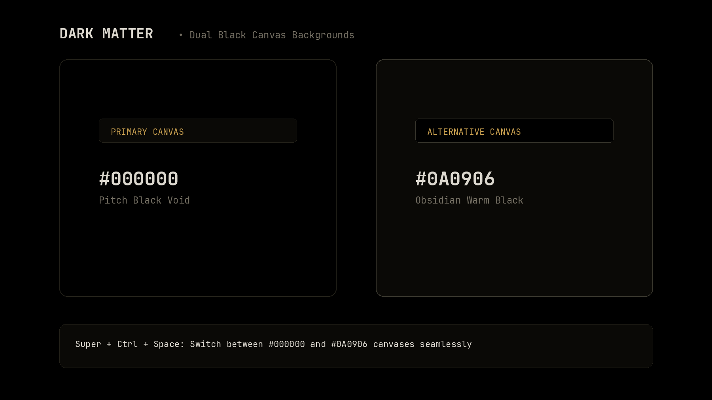

# Dark Matter

A minimalist Omarchy theme designed around a pure pitch-black void canvas (`#000000`), deep obsidian alternative black surfaces (`#0A0906`), and a multi-tiered dark architecture accented with warm stellar gold.



## At a glance

**Included with the install command:**

- Multi-tiered semantic dark palette based on `#000000` base canvas and `#0A0906` obsidian accents.
- Dual 4K blank solid canvas wallpapers selectable via the Omarchy background switcher.
- Hyprland window decorations with subtle gold-to-obsidian gradient borders and drop shadows.
- Dedicated Omarchy shell configuration for the status bar, launcher, menus, notifications, and lock screen.
- GTK 3/4 and Libadwaita color definitions.
- Preconfigured themes for VS Code, Neovim, Obsidian, Btop system monitor, and terminals (Ghostty, Alacritty, Kitty, Foot).

**Added by the full theme link (developer / manual mode):**

- Direct symlink configuration ensuring Hyprland Lua scripts and terminal configurations are loaded without stripping.
- Custom `aether.nvim` highlight groups for Neovim (Telescope, statuslines, tabs, and syntax trees).

## Backgrounds

The theme includes two 4K blank solid-color canvas wallpapers. Cycle between them with the background switcher (`Super + Ctrl + Space`) or `omarchy theme bg next`.

| Canvas | File | Hex Code | Description |
|:---|:---|:---|:---|
| **Pitch Black** | `backgrounds/0-pitch-black-#000000.png` | `#000000` | Pure pitch-black void canvas. |
| **Alternative Black** | `backgrounds/1-alternative-black-#0a0906.png` | `#0A0906` | Deep obsidian warm black canvas. |

## Installation

### Standard installation

```bash
omarchy theme install https://github.com/visual-zimbabwe/omarchy-dark-matter-theme.git
```

### Full theme link (recommended for custom Lua and full config)

Omarchy strips Lua and terminal configuration files from themes installed directly from git repositories for security. To load the complete configuration including `hyprland.lua` and `neovim.lua`:

```bash
git clone https://github.com/visual-zimbabwe/omarchy-dark-matter-theme.git ~/.local/share/omarchy-dark-matter-theme
rm -rf ~/.config/omarchy/themes/dark-matter
ln -s ~/.local/share/omarchy-dark-matter-theme ~/.config/omarchy/themes/dark-matter
omarchy theme set dark-matter
```

## Palette and Token Architecture

| Tier | Role | Hex Code | Applied Surfaces |
|:---|:---|:---|:---|
| Tier 0 | Base Void Canvas | `#000000` | Pitch-black wallpaper canvas, terminal background, main viewports |
| Tier 1 | Alternative Black | `#0A0906` | Secondary canvas wallpaper, sidebars, headerbars, drawer panels |
| Tier 2 | Dark Surface | `#050403` | Headerbar backdrop tints, deep statusline accents |
| Tier 3 | Elevated Surface | `#14120E` | Floating cards, tooltips, popups, cursor lines |
| Tier 4 | Selection and Chrome | `#26231C` | Selected list rows, search matches, active item highlights |
| Tier 5 | Subtle Borders | `#38342A` | Window dividers, card outlines, separator rules |
| Tier 6 | Muted Text | `#5C5648` | Inactive labels, line numbers, subtle hints |
| Tier 7 | Secondary Text | `#7A7362` | Metadata, comments, placeholders |
| Tier 8 | Primary Foreground | `#ECE6D8` | High-contrast warm off-white body text |
| Tier 9 | Bright Foreground | `#FFFFFF` | Star-white highlights, active badges, cursor |

### Accent and Syntactic Colors

| Role | Normal | Bright | Used for |
|:---|:---|:---|:---|
| Stellar Gold (Accent) | `#C9A050` | `#DFB666` | Primary accents, prompt, cursor, active border gradient, selected indicators |
| Red | `#E05A47` | `#FF6E5A` | Errors, deletions, urgent alerts |
| Orange | `#E68A38` | `#FF9F4D` | Warnings, modifications, numeric constants |
| Yellow | `#E5B842` | `#FFD05B` | Search matches, types, interfaces |
| Green | `#7EBA68` | `#98D87E` | Success, git additions, strings |
| Cyan | `#4EB8BA` | `#6AD4D6` | Parameters, properties, constants, links |
| Blue | `#5D93B8` | `#78B0D6` | Functions, methods, namespaces, control flow |
| Magenta | `#A872D1` | `#C28BEA` | Keywords, macros, markdown headings |

## Window and Shell Configuration

### Hyprland (`hyprland.lua`)

- **Active Border**: Gradient transitioning from Stellar Gold (`#C9A050`) to Alternative Obsidian Black (`#0A0906`) at 45 degrees.
- **Inactive Border**: Subtle 2-pixel obsidian border (`rgba(1A1813aa)` to `rgba(0A0906aa)`).
- **Rounding and Gaps**: Squircle rounding (`rounding = 12`) with `gaps_in = 6` and `gaps_out = 12`.
- **Drop Shadows**: Deep elevation shadow (`color = rgba(00000099)`, `range = 24`, `render_power = 4`).
- **Layer Blur**: Dual-pass blur on all Omarchy shell namespaces (`omarchy-bar`, `omarchy-menu`, `omarchy-notifications`, `omarchy-osd`, `omarchy-polkit`).

### Omarchy Shell (`shell.toml`)

- **Status Bar**: Obsidian black (`#0A0906`, alpha 0.92) with warm off-white text and interactive chips.
- **Launcher and Menu**: Frosted `#0A0906` surface with gold active row highlights and pitch-black scrim.
- **Notifications**: Floating obsidian card with a `#C9A050` countdown bar.
- **Lock Screen**: Pitch-black void with active gold input indicator.

## Application Theming

- **GTK 3/4 & Libadwaita** (`gtk.css`): Full `@define-color` mapping for GNOME/GTK applications.
- **VS Code / Codium** (`vscode-theme.json`): Pitch-black editor viewport with semantic token coloring.
- **Neovim** (`neovim.lua`): Tailored `aether.nvim` highlights for Telescope, floating windows, statuslines, and tabs.
- **Helix Editor** (`helix.toml`): Native Dark Matter syntax and UI palette.
- **Obsidian** (`obsidian.css`): Pitch-black notes viewport with obsidian sidebars and gold headings.
- **Btop System Monitor** (`btop.theme`): Multi-tier temperature, CPU, memory, and network gradient graphs.
- **Terminals** (`ghostty.conf`, `alacritty.toml`, `kitty.conf`, `foot.ini`): Pitch-black background with high-contrast warm text.

## Keybindings

| Shortcut | Action |
|:---|:---|
| `Super + Ctrl + Space` | Open Background Switcher to choose between `#000000` and `#0A0906` blank canvases |
| `Super + Shift + Ctrl + Space` | Open Theme Switcher |
| `omarchy theme bg next` | Cycle to the next canvas background |
| `omarchy theme set dark-matter` | Apply Dark Matter theme |

## License

[MIT](LICENSE). Copyright (c) 2026 visual-zimbabwe.
