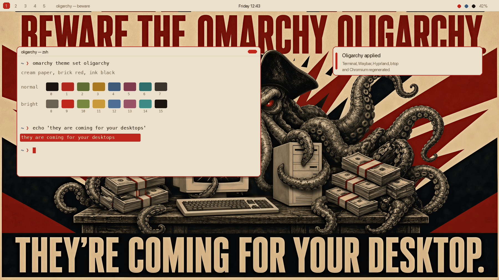
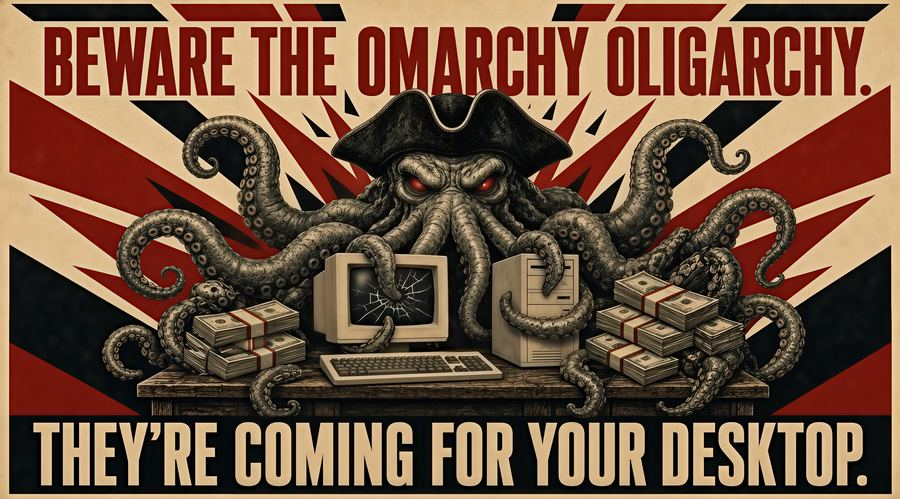
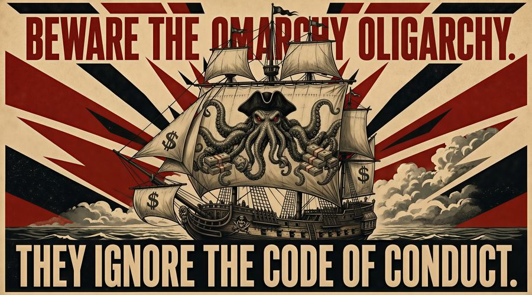
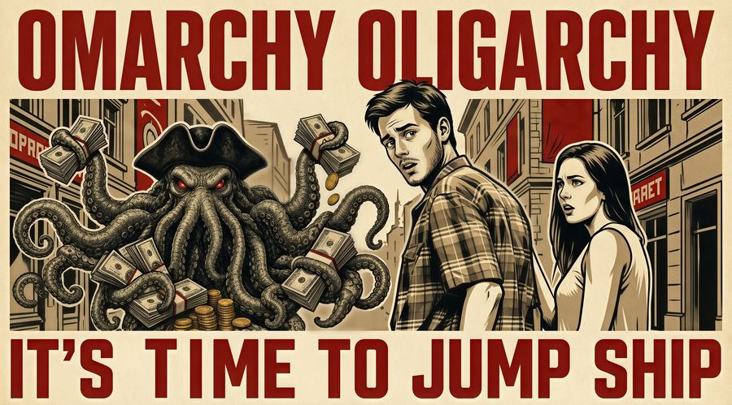
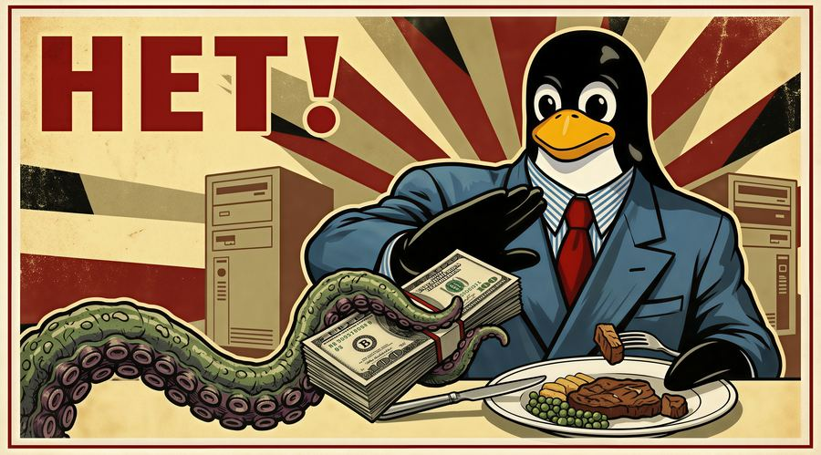

# Oligarchy — an Omarchy theme

A propaganda-poster **light** theme for [Omarchy](https://omarchy.org), with
colours lifted straight from the *"Beware the Omarchy Oligarchy"* poster:
cream paper, brick red, ink black, and aged ochre / olive / slate secondaries.

Selection mimics the poster's red banners — cream text on a red bar.

It has a theme song: [**Omarchy Oligarchy**](https://youtu.be/ZkQ5AHncfP0).



## Palette
- **Paper** `#eae0cb` · **Ink** `#1a160f`
- **Red** `#c0271c` (accent + selection) · **Ochre** `#a9791f` · **Olive** `#5e6b33` · **Slate** `#3e5a78`

ANSI "white" (`color7` and `color15`) is inked rather than pale. On cream paper
a literal white is invisible; Omarchy's own light themes invert it the same way,
and recent Omarchy force-sets `color7` to `foreground` regardless.

## Backgrounds

Four posters ship in `backgrounds/`, each 4096×2272. Cycle them with
`omarchy theme bg next`, or drop your own into
`~/.config/omarchy/backgrounds/oligarchy/` to add to the rotation. Omarchy
walks the directory in sorted order, so the numeric prefixes set which poster
you get first.

<table>
  <tr>
    <td width="50%">
      <a href="backgrounds/1-kraken-desktop.jpg"></a><br>
      <b>1 — They're coming for your desktop</b><br>
      The kraken at the terminal, and the poster the palette was sampled from.
    </td>
    <td width="50%">
      <a href="backgrounds/2-kraken-coc.jpg"></a><br>
      <b>2 — They ignore the code of conduct</b><br>
      The same kraken as a figurehead, under dollar sails.
    </td>
  </tr>
  <tr>
    <td width="50%">
      <a href="backgrounds/3-kraken-jump-ship.jpg"></a><br>
      <b>3 — It's time to jump ship</b><br>
      The distracted boyfriend, rendered in poster ink.
    </td>
    <td width="50%">
      <a href="backgrounds/4-kraken-njet.jpg"></a><br>
      <b>4 — Нет!</b><br>
      Tux declines the envelope. Warmer and more saturated than the other
      three, so it sits a little outside the strict palette.
    </td>
  </tr>
</table>

## Install

```sh
omarchy theme install https://github.com/AlexanderBuzz/omarchy-oligarchy-theme.git
```

The repo name becomes the menu entry: Omarchy strips the `omarchy-` prefix and
the `-theme` suffix, so this installs as **Oligarchy**. To work on it locally
instead, clone or symlink it into `~/.config/omarchy/themes/oligarchy` and pick
it in the theme selector.

The empty `light.mode` file tells Omarchy to pair the theme with light mode
across all apps.

## What's in here

`colors.toml` is the source of truth. Omarchy renders it through
`default/themed/*.tpl` to generate the configs for terminal (Alacritty, Ghostty,
Kitty, foot), Waybar, Hyprland, Hyprlock, Walker, Mako, SwayOSD, btop, Helix,
Chromium and keyboard RGB — none of which need to live in this repo.

The rest is what Omarchy does **not** generate:

| File | Purpose |
|---|---|
| `backgrounds/` | The four posters, as wallpaper |
| `light.mode` | Marks the theme as light |
| `icons.theme` | `Yaru-red`, to match the accent |
| `neovim.lua` | Drives `aether.nvim` from the poster palette |
| `vscode.json` | Names the VS Code theme and extension to install |
| `unlock.png` | Plymouth boot-splash wordmark |
| `preview-unlock.png` | Preview for the unlock/Plymouth picker |
| `preview.png` | Preview for the theme switcher |

`docs/` holds downscaled copies of the backgrounds for this README only —
Omarchy never reads it.

## A note on `neovim.lua` and `vscode.json`

Recent Omarchy treats a theme cloned from a git repo as untrusted and drops
anything from it that can run code — every `*.lua`, the terminal configs, and
`vscode.json` — then generates those from its own templates instead. Hyprland
`require`s a theme's Lua at login and a VS Code extension is arbitrary
JavaScript, so this is a sensible rule and this theme does not try to work
around it.

The practical effect: on Omarchy 3.8.x these two files apply as written; on
newer releases your Neovim and VS Code colours come from Omarchy's templates,
fed by the same `colors.toml`. The palette is identical either way.

`vscode.json` points at `flexoki-light` — the nearest published marketplace
theme, cream paper and ink text, though its accent is blue rather than brick
red. There is no Oligarchy VS Code extension to name. Removing the file is
worse than keeping it: with it absent, `omarchy-theme-set-vscode` strips
`workbench.colorTheme` from your settings entirely.

## Credits

The Plymouth wordmark in `unlock.png` and `preview-unlock.png` is Omarchy's own,
recoloured to the theme accent — the same asset every first-party theme ships.

MIT licensed. See [LICENSE](LICENSE).
