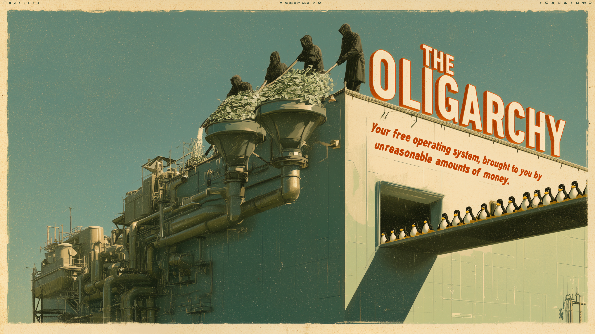
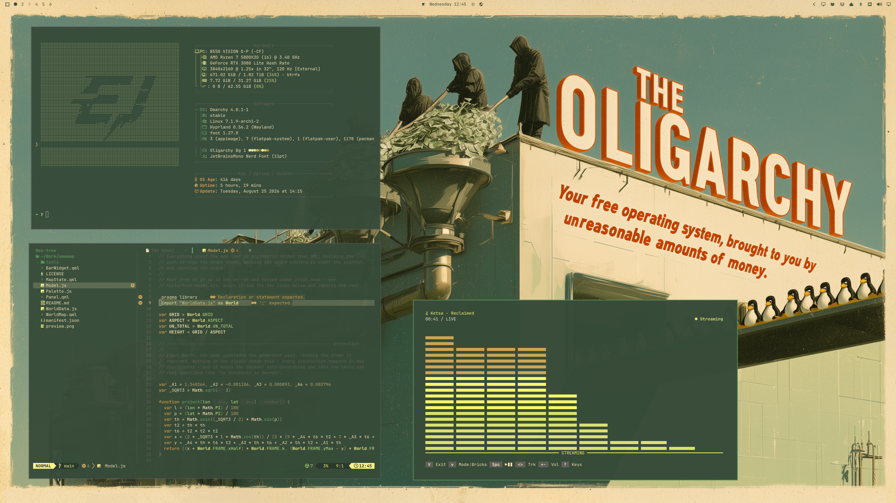
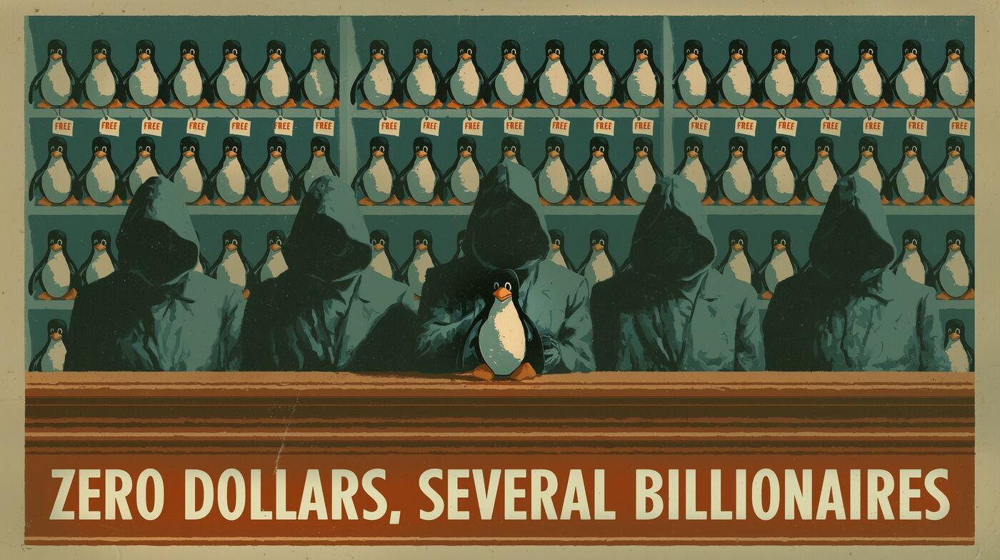
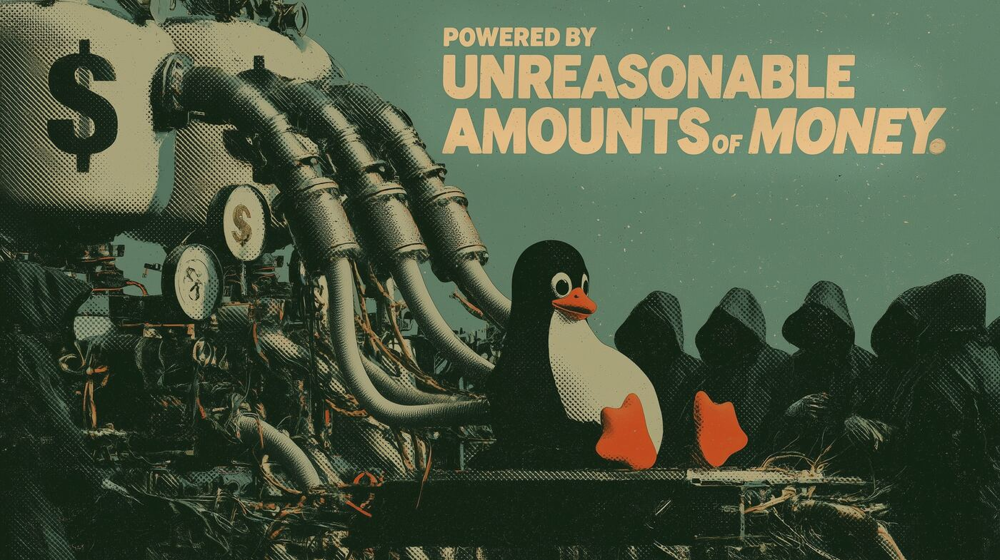

# Oligarchy

An [Omarchy](https://omarchy.org/) theme. Muted olive-green backgrounds, pale gold
foreground, green accent — with retro-poster wallpapers about who actually pays for
your free operating system.





## Install

```bash
omarchy theme install https://github.com/ejuro/oligarchy-theme.git
```

That clones the repo into `~/.config/omarchy/themes/oligarchy` and applies it.

To switch to it later, or after installing something else:

```bash
omarchy theme set oligarchy
```

Cycle through the three wallpapers with `omarchy theme bg next`, or open the
picker with `omarchy theme bg-switcher`.

## Update

```bash
omarchy theme update
```

Updates every git-installed theme, this one included.

## Remove

```bash
omarchy theme remove oligarchy
```

## GTK apps

Omarchy themes GTK apps by switching them to Adwaita-dark and setting an icon
theme — it does not pass the palette along, so Nautilus and other GTK windows
stay default grey no matter which theme is active. This theme ships a `gtk.css`
that repaints them in the Oligarchy palette. Point GTK at the current theme's
copy once:

```bash
mkdir -p ~/.config/gtk-3.0 ~/.config/gtk-4.0
ln -sfn ~/.local/state/omarchy/current/theme/gtk.css ~/.config/gtk-3.0/gtk.css
ln -sfn ~/.local/state/omarchy/current/theme/gtk.css ~/.config/gtk-4.0/gtk.css
```

Restart the apps to pick it up — GTK reads this file at startup, so `nautilus -q`
and reopening is enough for Files. Qt apps follow too, since Omarchy points them
at the GTK platform theme.

The symlinks track whichever theme is applied, so they keep working after
`omarchy theme set`. Switch to a theme that ships no `gtk.css` and they simply
dangle: GTK falls back to plain Adwaita-dark, which is what you had before.

## Backgrounds

The three posters are 2912×1632; the wordmark is 3840×2160. Click one for the
full-size image.

[](backgrounds/1-oligarchy-factory.jpg)

`1-oligarchy-factory.jpg`

[](backgrounds/2-zero-dollars-several-billionaires.jpg)

`2-zero-dollars-several-billionaires.jpg`

[](backgrounds/3-unreasonable-amounts-of-money.jpg)

`3-unreasonable-amounts-of-money.jpg`

[](backgrounds/oligarchy.png)

`oligarchy.png` — the plain wordmark, in the style of the stock Omarchy
background. Sorts last, so `omarchy theme bg next` reaches it after the posters.

To add your own without touching this repo, drop images into
`~/.config/omarchy/backgrounds/oligarchy/` — Omarchy picks them up alongside the
bundled ones and they survive `omarchy theme update`.

## Palette

| | |
|---|---|
| background | `#374b39` |
| dark background | `#29382b` |
| darker background | `#1c261d` |
| lighter background | `#4b5d4d` |
| foreground | `#F7E2B1` |
| accent | `#5a9059` |
| selection | `#4c744c` |
| muted | `#5e5f59` |

| | normal | bright |
|---|---|---|
| red | `#b09153` | `#cda555` |
| yellow | `#fff78c` | `#fff76c` |
| green | `#c5ca74` | `#dde26f` |
| cyan | `#c4ea82` | `#d6ff80` |
| blue | `#5a9059` | `#65a865` |
| magenta | `#de9d54` | `#ffae4b` |
| orange | `#bca26d` | |
| brown | `#716141` | |

Icons: `Yaru-yellow`.

## License

Theme files are MIT (see `LICENSE`). The wallpapers are AI-generated images,
free to use and redistribute with the theme.
