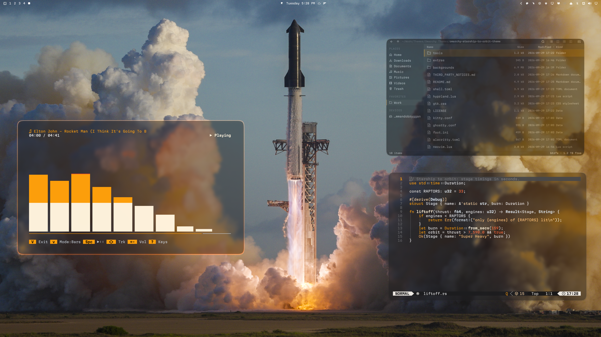
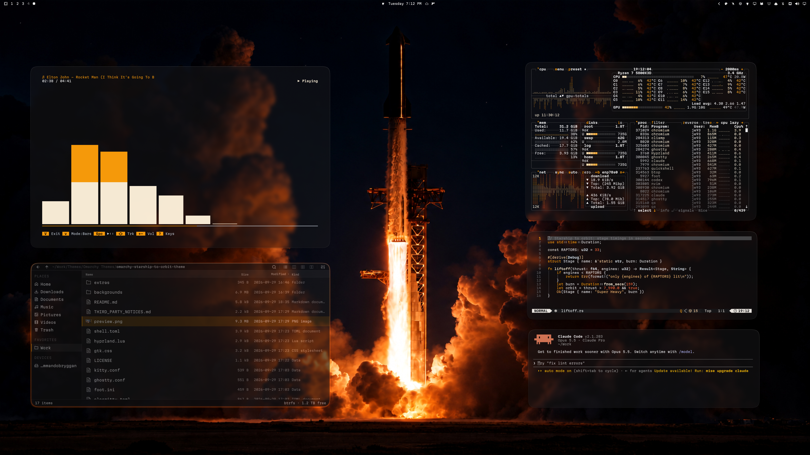
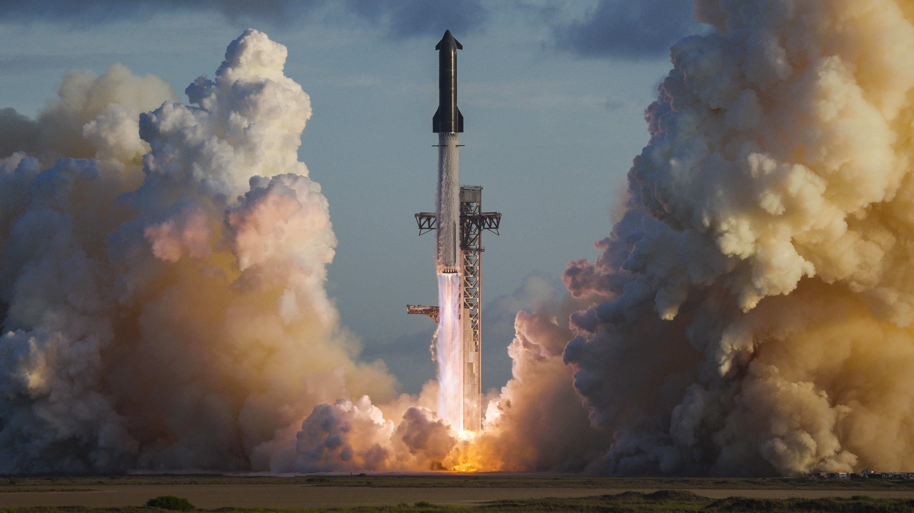
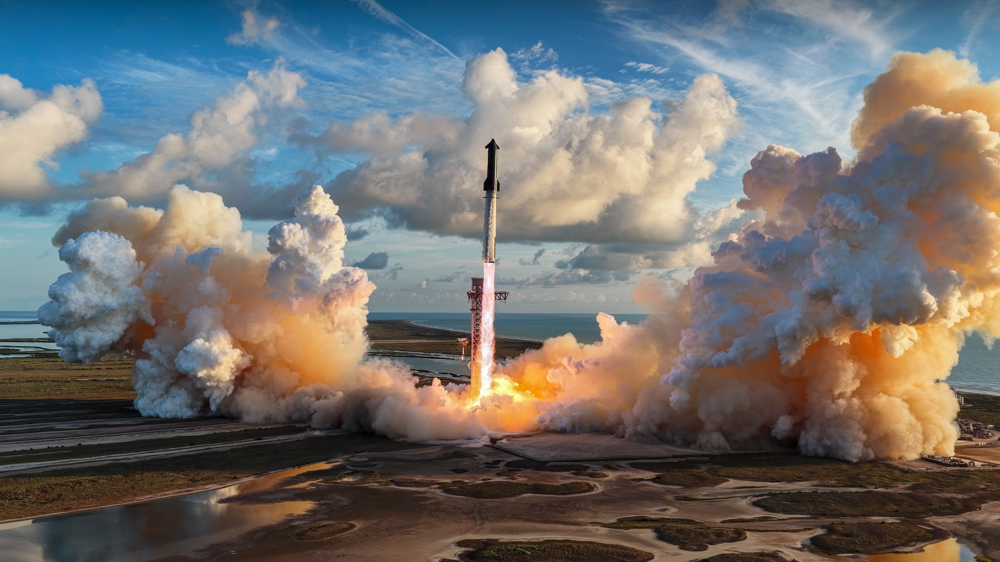
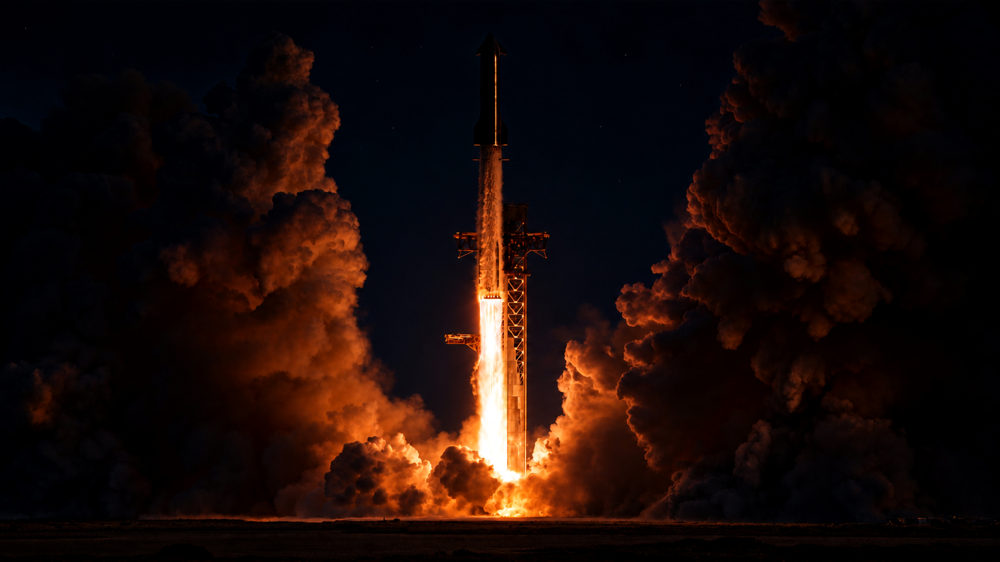
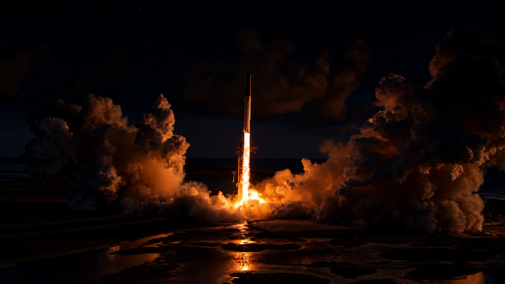

# Starship To Orbit

An Omarchy theme celebrating Starship's flight to orbit: white text on lightly frosted liquid glass over the launch, by day or by night, with the Raptor plume as the one colour that runs through it all.





By day and by night: the [cliamp](https://github.com/bjarneo/cliamp) music visualizer, [Flea](https://github.com/ejuro/flea), Neovim and, at night, btop and Claude Code, using Starship To Orbit with the full glass effect.

## At a glance

**Included with the install command:**

- The palette: white and grey text, with the Raptor plume (white-hot → engine flame → red-orange) as the one colour.
- Plume-edged windows.
- A translucent glass shell: bar, launcher, menus, notifications and lock screen.
- btop with every graph drawn as the plume.
- GTK colours, and four launch backgrounds: two by day, two by night.

**Added by the optional [full glass effect](#full-glass-effect-optional)** (one extra step):

- Lightly frosted windows and shell panels, with the launch showing through.
- Translucent terminals with fully opaque text.
- Squircle corners and a faint warm glow.
- Code in Neovim in the colours of the plume.

**Separate and optional:**

- [Ghostty as the default terminal](#full-glass-effect-optional), so terminals are frosted rather than clear.
- [Martian Mono](#recommended-font-optional), the font the theme was made with.
- A [cliamp theme](#extras) that draws the music visualizer as the plume.

## Backgrounds

Two SpaceX launch photographs, each by day and by night. Omarchy starts with the first; cycle through them with the background switcher (`Super + Ctrl + Space`) or `omarchy theme bg next`.

| | |
| --- | --- |
| [](backgrounds/1-liftoff.jpg) | [](backgrounds/2-starbase.jpg) |
| **Liftoff**, 3732 × 2099. Photo: SpaceX. Starship clearing the tower at dusk between walls of exhaust. | **Starbase**, 4096 × 2304. Photo: SpaceX. The launch from above, over the pad and the Gulf. The top edge is gently shaded so a transparent bar keeps white text. |
| [](backgrounds/3-liftoff-night.jpg) | [](backgrounds/4-starbase-night.jpg) |
| **Liftoff, night.** The same launch relit at night: the plume is the only light and the exhaust clouds glow from it. | **Starbase, night.** The pad and the water reflect the flame. |

The night versions are AI-edited from the photographs above, not photographs of real night launches (see [third-party notices](THIRD_PARTY_NOTICES.md)).

## Install

```bash
omarchy theme install https://github.com/ejuro/omarchy-starship-to-orbit-theme.git
```

Tested on Omarchy **4.0.4**.

### Full glass effect (optional)

Omarchy skips Lua and terminal configs from installed themes for safety, so the command above gives you the palette, the plume window edges, the translucent shell and the btop graphs, but not the frosted glass. To add the glass, read [`hyprland.lua`](hyprland.lua), [`neovim.lua`](neovim.lua) and the terminal configs, then run:

```bash
git clone https://github.com/ejuro/omarchy-starship-to-orbit-theme.git ~/.local/share/omarchy-starship-to-orbit-theme
rm -rf ~/.config/omarchy/themes/starship-to-orbit
ln -s ~/.local/share/omarchy-starship-to-orbit-theme ~/.config/omarchy/themes/starship-to-orbit
omarchy theme set starship-to-orbit
```

That adds:

- Lightly frosted windows: the launch stays recognisable behind them, only fine detail is softened.
- Terminals with a translucent background and fully opaque text; [Omawrite](https://github.com/ejuro/omawrite) and [Flea](https://github.com/ejuro/flea) turn to glass too. Everything else stays opaque.
- Large squircle corners and the faintest warm glow on the focused window.
- The same frosting on the launcher, menus, notifications, OSD and polkit dialogs.
- Code in Neovim in the colours of the plume.

Ghostty frosts the glass. Foot's translucent background is not blurred by Hyprland, so it stays clear glass; to use frosted glass everywhere, switch the default terminal:

```bash
omarchy default terminal ghostty
```

### Recommended font (optional)

The theme was made with Martian Mono, a wide, geometric typeface with a mission-control feel:

```bash
omarchy pkg add ttf-martian-mono-nerd
omarchy font set "MartianMono Nerd Font"
```

## The Raptor plume

One gradient runs through the whole theme: white-hot `#fff3dc` → engine flame `#ff9f0a` → red-orange `#ff4f1f`. It edges the focused window and the shell's panels, draws every graph in btop, colours code in Neovim, and drives the cliamp visualizer (see [Extras](#extras)).

Everything else is white, icy white and grey, told apart by brightness rather than hue. Colour is kept for meaning:

| Role | Colour | Used for |
| --- | --- | --- |
| Engine flame | `#ff9f0a` | Accent, prompt, cursor, selected items, warnings |
| Red | `#ff5f4a` | Errors, removed lines |
| Pale green | `#a8e6c1` | Success, added lines |
| Text | `#f5f5f7` | |
| Icy white · silver · warm white | `#dfe9f2` · `#c3ccd6` · `#f2eee8` | Terminal colours |
| Secondary text | `#98989d` | |
| Glass | `#1c1c1e` | Surfaces, at 32–60 % opacity |
| Selection | `#3a3a3c` | |

In Neovim, keywords are engine flame, function names white-hot, strings amber `#ffc27a`, numbers red-orange `#ff6a3d` and types icy white; git signs and diagnostics keep green and red.

## Extras

[`extras/cliamp/starship-to-orbit.toml`](extras/cliamp/starship-to-orbit.toml) is a matching theme for the [cliamp](https://github.com/bjarneo/cliamp) music player. Its visualizer is drawn as the plume: white-hot at the base, engine flame through the middle, red-orange at the tips.

```bash
mkdir -p ~/.config/cliamp/themes
cp ~/.config/omarchy/themes/starship-to-orbit/extras/cliamp/starship-to-orbit.toml ~/.config/cliamp/themes/
cliamp theme starship-to-orbit
```

## Customization

The colours live in `colors.toml`. `shell.toml`, `btop.theme` and `gtk.css` carry copies, and so do the terminal configs, `hyprland.lua` and `neovim.lua` used by the full glass effect; change them together, then run `omarchy theme set starship-to-orbit`.

The theme contains no application patches or install hooks.

## License

[MIT](LICENSE). Copyright (c) 2026 Erik Johansson.

The background images are not covered by the MIT license; see [third-party notices](THIRD_PARTY_NOTICES.md), which also records attribution for adapted upstream portions.
