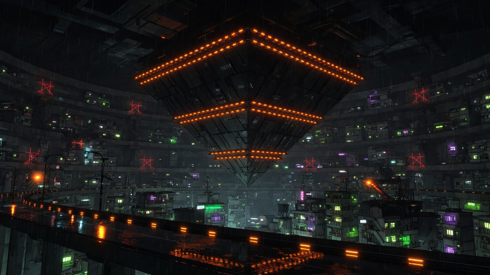
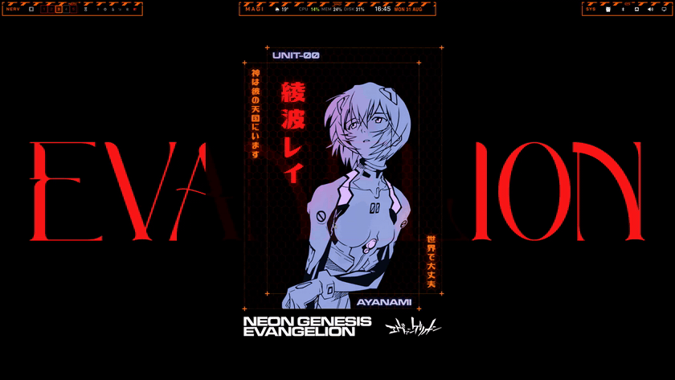

<p align="center">
  
</p>

<h1 align="center">Third Impact</h1>

<p align="center">
  An <b>Evangelion</b>-inspired dark theme for <a href="https://omarchy.org/">Omarchy</a>.
  <br/>
  Nerv orange. SEELE red. Depth where the LCL flows.
</p>

 <p align="center">
  
  
  
</p>

---

## Demo

A quick look at the theme in action on a stock Omarchy desktop:

<p align="center">
  
  <br/>
  <sub>14s · 1080p · <a href="media/demo.mp4">full video (mp4)</a></sub>
</p>

---

## Contributing

**Pull requests, issues and suggestions are very welcome.**

This is the theme I genuinely run on my own machine every day — it's not a
throwaway project. I intend to keep maintaining it, refining it, and pushing
updates over time, so:

- Found a color that feels off? Open an **issue** or tweak the palette in
  [`colors.toml`](colors.toml) and send a **pull request**.
- Added a wallpaper or improved an app config? PR it in.
- Just want to share feedback? Open a discussion — it all helps.

If you fork or adapt it, credit is appreciated but not required. Let's make
**Third Impact** better together.

---

## Design

**Third Impact** evokes the world of *Neon Genesis Evangelion* — the sunken
Nerv command center, the cold safety-orange of the mechanicals, and the crimson
panic of the angelic threat that looms over it all.

- **Accent `#FF6A00`** — the Nerv orange, used for highlights, borders and focus.
- **Red `#C41E3A`** — the alert crimson, paired into an angled active-window
  border gradient (`45deg`).
- **Near-black warm backgrounds** (`#0c0a0d`) that let the LCL-style glow breathe.
- **Warm beige foregrounds** (`#e8dcc8`) for comfortable contrast on the dark.
- A **rotating wallpaper set** drawn from the series: the Geofront, the MAGI
  supercomputer core, the LCL chamber, and the silhouetted sentinels.

Everything is generated from a single palette — one file drives Hyprland
borders, the shell, terminals, Neovim and the lock screen.

---

## Installation

### One click

```bash
omarchy theme install https://github.com/Gedankenn/third-impact
```

That single command clones the repo **and** applies the theme. You are done —
the shell, backgrounds, borders and lock screen all update immediately.

> Re-apply manually anytime with `omarchy theme set "Third Impact"`.

### Requirements

- An [Omarchy](https://omarchy.org/) install (Hyprland + the Omarchy shell).

---

## Palette

The full palette lives in [`colors.toml`](colors.toml). The core roles:

| Token             | Color     | Use                    |
|-------------------|-----------|------------------------|
| `accent`          | `#FF6A00` | Highlights, focus      |
| `red`             | `#C41E3A` | Alerts, active border  |
| `background`      | `#0c0a0d` | Base background        |
| `dark_background` | `#080608` | Deeper surfaces        |
| `foreground`      | `#e8dcc8` | Primary text           |
| `muted`           | `#3d2a24` | Dim text, inactive     |
| `selection`       | `#2a1510` | Selections             |

Rendered components:

| Layer          | Value |
|----------------|-------|
| Active border  | `rgba(ff6a00ee) rgba(c41e3aee) 45deg` |
| Inactive border| `rgba(3d2a24aa)` |

---

## Wallpapers

The theme bundles a rotating Evangelion set in `backgrounds/` (Geofront, MAGI
core, LCL chamber, sentinels, and more), which works out of the box.

**Prefer your own wallpaper folder?** When you keep your collection in
`~/Pictures/Wallpapers` (a common setup), point the theme at it with the
bundled script:

```bash
./setup-wallpapers.sh
```

It symlinks every image in `~/Pictures/Wallpapers` into the theme's user
wallpaper folder (`~/.config/omarchy/backgrounds/third-impact/`), also copying
over the theme's own Evangelion wallpapers so nothing is left out. Your theme
then cycles through your personal collection instead.

- Different folder? `WALLPAPER_DIR=/path/to/walls ./setup-wallpapers.sh`
- Omarchy merges `backgrounds/` (bundled) **and** `~/.config/omarchy/backgrounds/third-impact/` (yours) automatically — no config needed.

---

## Repository layout

```
third-impact/
├── colors.toml        # Single source of truth for all colors
├── hyprland.lua       # Active / inactive window border gradient
├── neovim.lua         # Neovim colorscheme (aether)
├── shell.lock.toml    # Lock screen colors
├── icons.theme        # Icon set
├── chromium.theme     # Chromium / browser chrome
├── keyboard.rgb       # Keyboard RGB
├── unlock.png         # Lock screen artwork
├── preview.png           # Theme preview (banner)
├── setup-wallpapers.sh   # Point the theme at your ~/Pictures/Wallpapers
├── media/demo.gif        # Animated demo (rendered in the README)
├── media/demo.mp4        # Full-length demo recording
└── backgrounds/          # Rotating Evangelion wallpaper set
```

> `hyprland.lua`, `neovim.lua` and terminal configs are **regenerated from
> `colors.toml`** on install — edit the palette, not the generated files.

---

## Legal

*Neon Genesis Evangelion is © of its respective rights holders (Khara /
Studio Khara). This theme is an unofficial fan project — not affiliated with,
endorsed by, or sponsored by anyone. Theme code and colors: ©
[Gedankenn](https://github.com/Gedankenn).*
