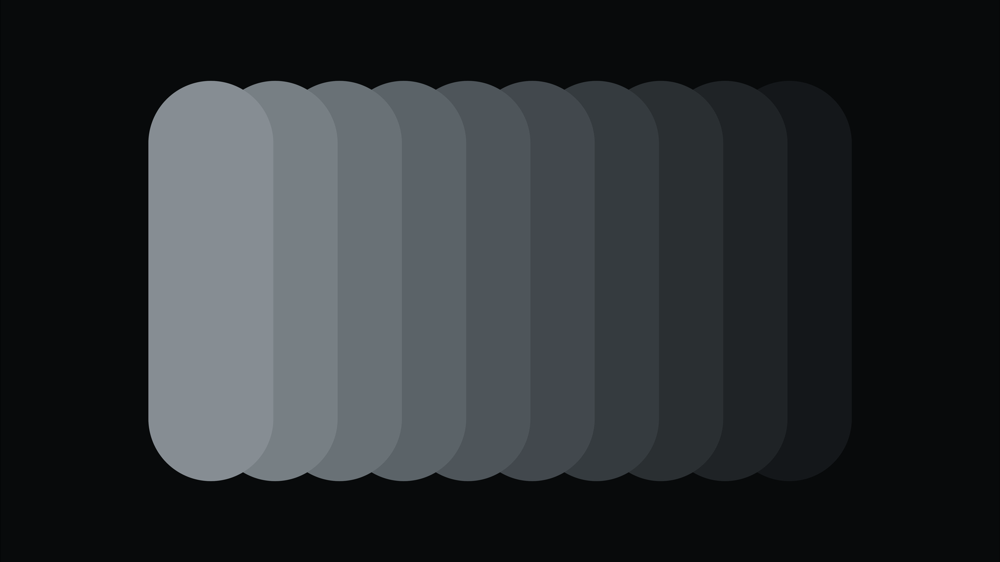
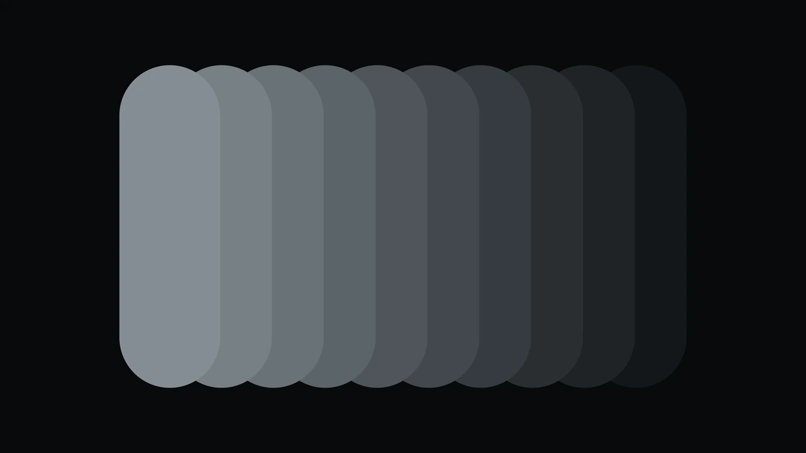
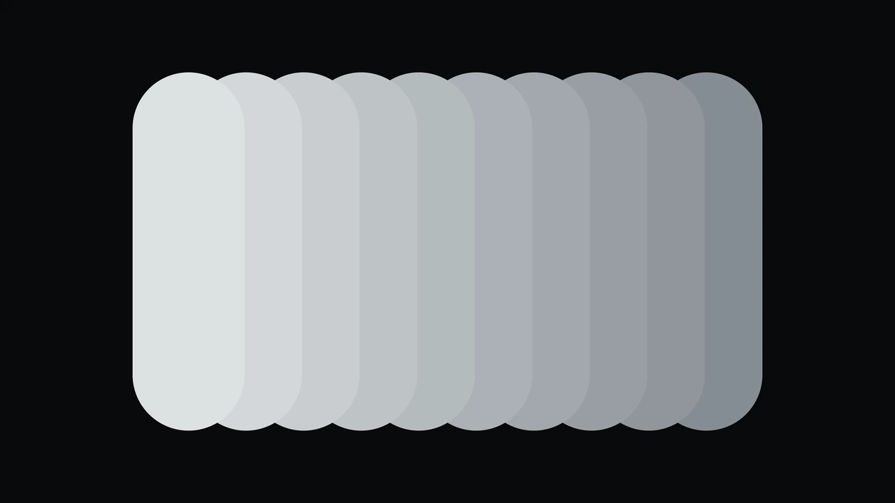
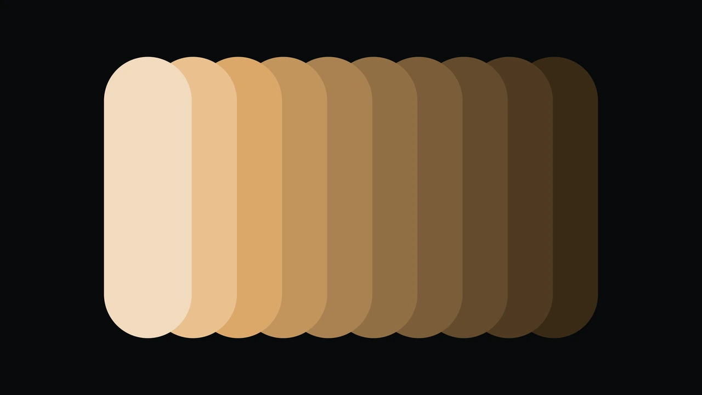
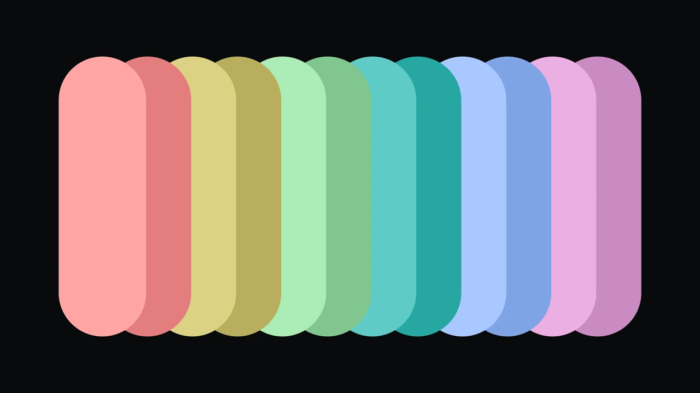
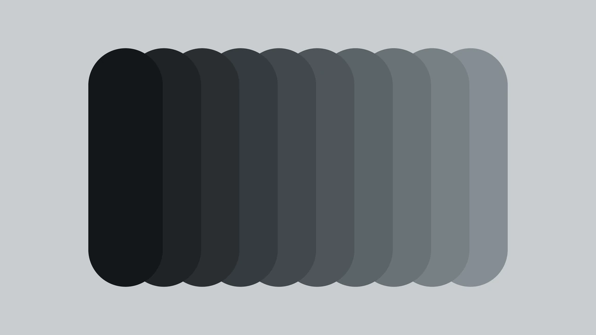

# Vernier

A dark theme for [Omarchy](https://omarchy.org). Solitude's geometry, measured
and regularised, with one brass voice.

A vernier is the second scale on a caliper, the one that reads finer than the
eye can. Nothing here was picked by eye either.



## Install

```bash
omarchy theme install https://github.com/thisisgm/omarchy-vernier-theme.git
```

## Where it comes from

Vernier is not inspired by Solitude, it is derived from it. Every constant in
`colors.toml` was measured off `/usr/share/omarchy/themes/solitude/colors.toml`
rather than chosen:

- the surface hue, OKLab **236.68**, is the chroma-weighted mean hue of
  Solitude's twelve-colour slate ladder;
- the chroma each **surface and ink** carries comes from a least-squares fit of
  Solitude's own chroma against lightness, `C(L) = 0.0660 * L^1.286 * (1-L)^1.117`,
  residual rms 0.00425. The ring does not use it: five of the six base ring
  colours are solved at one chroma, red carries more by design, and the accent
  has its own, all stated below;
- the accent hue, **70.9**, is the chroma-weighted mean hue of Solitude's two
  warm inks, `#cbc2be` and `#c9c2b4`. Solitude has a warm direction already; it
  just never spends it on anything;
- `darker_background` is byte-identical to Solitude's.

## What the measurement found

Solitude is a beautiful theme with six measurable faults. Vernier keeps the shape
and fixes them. The `Accent against its nearest ring colour` row is not one of
them: it is a constraint Solitude never had and Vernier adds.

| | Solitude | Vernier |
|---|---|---|
| Surface ladder, OKLab steps | 0.019, 0.022, 0.051 | even by construction at 0.0307; 8-bit quantisation lands them at 0.0320, 0.0309 and 0.0303 |
| Emphasis ink vs body ink | `bright_foreground` sits **0.098 darker** than `foreground` | ordered, emphasis is the lightest rung |
| Ring colours clearing WCAG AA on all four surfaces | 6 of 12 | **12 of 12** |
| Tightest pair meaning different things, worst case over normal, protan, deutan and tritan vision. A colour and its own bright variant are one meaning, so that pair is excluded | 0.0222, `red` against `bright_blue` | **0.0469** |
| A colour and its bright variant sharing one hex | `cyan` and `bright_cyan` are both `#707070` | all twelve distinct |
| Accent against its nearest ring colour | not a constraint | **0.0534** |
| A diff's `+` against its `-` | **inverted**, `bright_green` sits 0.290 darker than `bright_red` | `+` leads by 0.0685 for every viewer |

Foreground over background measures 11.06:1.

## The three rules

1. **One material.** Every surface and every ink sits on the same hue and
   carries the chroma its lightness earns. Paper and ink are the same stone.
2. **One voice.** Brass `#b38956` is the only colour allowed to be loud, and it
   means exactly one thing: this is what has focus. sRGB tops out at C 0.142 on
   this hue at this lightness, where the blue channel is down to 1 of 255 and the
   colour has gone to mustard. It is held at C 0.085, where blue still reads
   86, which is what keeps it brass.
3. **Everything clears AA.** All twelve ring colours clear 4.5:1 against all four
   surfaces. That requirement is what costs the ring its lightness range, and it
   is why the ring is solved rather than picked.

## Why the ring is solved, not picked

Solitude's ring is deliberately near-neutral, and measurement says a fully
neutral ring cannot carry twelve meanings. Clearing AA against the lightest
surface puts a floor at OKLab lightness 0.616, and the twelve end up between
0.659 and 0.885, a span of 0.23 to hold twelve meanings. Under dichromacy the
red-green axis is gone, so hue can only help along blue-yellow.

Chroma is the other lever, and it is spent sparingly. Five of the six base
colours are solved at **C 0.105**, which is where a chroma sweep stopped
buying separation, and 8-bit quantisation lands them at 0.105 or 0.106; `red`
sits at 0.126, the 20 percent exemption below; and the brights land between
0.086 and 0.107 once eased and gamut-clipped.

The accent is solved as a thirteenth meaning, not left out of it. Focus is a
distinct thing from an error or a success, so `#b38956` sits in the same
separation cost as the twelve. Leaving it out of that cost is not hypothetical:
an earlier build did exactly that and put the accent **0.0239** from `red`,
tighter than anything inside the ring. Constrained, it sits at 0.0534.

Only the six base ring colours are solved that way. Each bright variant is
derived from its base at a lightness step solved per family, 0.108 to 0.119,
with chroma eased 5 percent and then clipped to the sRGB gamut. The clip is what
it sounds like: `bright_red` and `bright_blue` sit on the gamut boundary and lose
15 and 18 percent of their base chroma rather than 5. Every family still
separates by lightness, which is the property the step exists for.

Solving all twelve independently scored better on paper and produced `green` and
`bright_green` at the same hex, which is the exact defect this theme exists to
fix.

Red is the one exemption: it carries 20 percent more chroma, because an error
that fails to alarm has failed.

### Surfaces

| name | hex | OKLab L |
|---|---|---|
| `darker_background` | `#080a0b` | 0.143 |
| `dark_background` | `#0e1112` | 0.175 |
| `background` | `#14181a` | 0.206 |
| `lighter_background` | `#1b1f21` | 0.236 |

One more colour sits on the same hue without a `colors.toml` key, because Omarchy
has no key for it. `#626a6f` at lightness 0.519 is the neutral border
`shell.hyprland.toml` gives to menus, tooltips and popups. It is not a step on
the ladder above; it is simply the darkest colour on that hue which still clears
3:1 against the raised card it outlines, measured 3.02:1.

### Ink

| name | hex | OKLab L | worst contrast on any surface |
|---|---|---|---|
| `bright_foreground` | `#dde0e2` | 0.905 | 12.52:1 |
| `foreground` | `#c8ccd0` | 0.843 | 10.28:1 |
| `light_foreground` | `#b3b9bd` | 0.782 | 8.38:1 |
| `dark_foreground` | `#9fa6ab` | 0.721 | 6.73:1 |
| `muted` | `#868d93` | 0.640 | 4.94:1 |

### Ring

| name | hex | OKLab L | C | hue | worst contrast on any surface |
|---|---|---|---|---|---|
| `red` | `#e37d7d` | 0.702 | 0.126 | 20.8 | 5.93:1 |
| `yellow` | `#b8ae5c` | 0.742 | 0.105 | 102.4 | 7.31:1 |
| `green` | `#82c68e` | 0.766 | 0.106 | 149.0 | 8.24:1 |
| `cyan` | `#27a6a2` | 0.659 | 0.105 | 191.7 | 5.58:1 |
| `blue` | `#80a4e6` | 0.718 | 0.105 | 262.1 | 6.62:1 |
| `magenta` | `#ca8bc2` | 0.717 | 0.105 | 331.1 | 6.31:1 |
| `bright_red` | `#ffa5a3` | 0.811 | 0.107 | 21.1 | 8.83:1 |
| `bright_yellow` | `#dbd183` | 0.851 | 0.099 | 101.9 | 10.64:1 |
| `bright_green` | `#abecb6` | 0.885 | 0.099 | 149.2 | 12.18:1 |
| `bright_cyan` | `#5ecbc6` | 0.777 | 0.100 | 191.2 | 8.57:1 |
| `bright_blue` | `#a8c7ff` | 0.827 | 0.086 | 262.1 | 9.71:1 |
| `bright_magenta` | `#ecaee3` | 0.825 | 0.100 | 331.5 | 9.28:1 |

## Backgrounds

Five wallpapers, one layout, five ramps, all rendered natively at 6016 x 3384
(16:9 6K). The layout is a fanned stack of rounded swatches, measured off a
reference render rather than eyeballed: card width 0.125 of the frame, step
0.0643, so cards overlap 49 percent; card height 0.7122; corner radius half the
card width, which makes each card a stadium. Ten cards, except `4-palette`, which
carries twelve because the ring has twelve colours.

Flat fills, no shadow, no gradient, and no dither, because a frame of flat fills
has no gradient to band. Shapes are composited by coverage in linear light, so an
edge never picks up the dark fringe that blending encoded sRGB produces.

The flat-fill claim you can confirm on the shipped PNGs without trusting me.
Every master is 6016 x 3384, and its eleven most common colours account for at
least 99.79 percent of its pixels. `4-palette` carries twelve cards plus a
ground, so for that one it is the top thirteen. What is left is the one-pixel
anti-aliased seam along every shape edge, against the ground or against whichever
card lies beneath.

This needs a colour histogram rather than a count of distinct colours. A distinct
count returns between 859 and 3985 values depending on the master, because those
seams take intermediate values the flat fills never use, and a reader who ran
that would think the claim had failed. Pass the file and its fill count:

```python
import numpy as np
from PIL import Image

def flat_share(path, fills):
    a = np.asarray(Image.open(path).convert("RGB")).reshape(-1, 3)
    _, counts = np.unique(a, axis=0, return_counts=True)
    return round(np.sort(counts)[-fills:].sum() / len(a), 5)

print(flat_share("backgrounds/1-surfaces.png", 11))   # 0.99833
print(flat_share("backgrounds/4-palette.png", 13))    # 0.99798
```

That each master is also byte-identical to what its source renders is not
something this repo lets you check, because the renderer is not published. Take
that one as an author's claim.

### 1-surfaces



The paper ladder. Ten stops from the canvas surface up to comment grey, on the deepest surface. The quietest of the five. Mean relative luminance 0.0565.

### 2-ink



The ink ladder. Comment grey up to emphasis ink, a close-valued study where the whole ramp spans 0.265 in lightness. Mean relative luminance 0.2456.

### 3-accent



Brass. Ten stops on the accent hue, each holding the same fraction of the sRGB gamut, so saturation reads constant while lightness does the work. Mean relative luminance 0.1548.

### 4-palette



The ring. All twelve ANSI colours in hue order, each family's bright leading its base, which doubles as a legibility check on the set. Mean relative luminance 0.2765.

### 5-inverted



The same surface ladder, dark leading, on content ink. The only light ground in the set, and the brightest of the five. Mean relative luminance 0.3519.

## Notes

Terminal colours render at Omarchy's stock window opacity, `0.985` focused and
`0.96` unfocused, so on-screen values sit slightly off the literal hex. That is a
compositor setting shared by every Omarchy theme, not a property of this one.
Omarchy applies it as a window rule rather than a decoration variable, and
`~/.config/hypr/hyprland.lua` requires only `monitors`, `input`, `bindings`,
`looknfeel` and `autostart`, so a `windows.lua` of your own is never read. Append
the rule to `~/.config/hypr/looknfeel.lua`, which is loaded, then `hyprctl reload`:

```lua
o.window({ tag = "default-opacity" }, { opacity = "1.0 1.0" })
```

Vernier is not affiliated with or endorsed by the Solitude theme or its author.
It is a derived work in the sense that its constants were measured from
Solitude's published palette.

## Support

If this saved you an afternoon, you can
[buy me a coffee](https://buymeacoffee.com/thisisgm).

## License

MIT. See [LICENSE](LICENSE).
